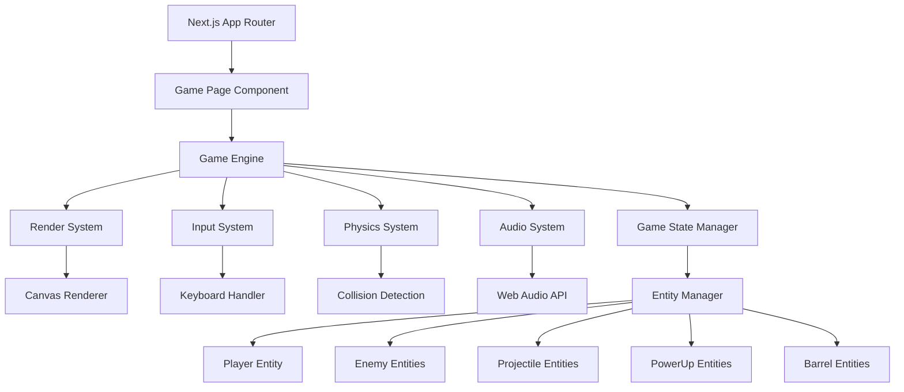

# Design Document

## Overview

The Vertical Defense Game is a browser-based arcade-style game built with Next.js 14 using the app router. The game utilizes HTML5 Canvas for high-performance rendering and implements a component-based architecture for game entities. The design emphasizes smooth 60fps gameplay, responsive controls, and impressive visual effects suitable for hackathon demonstration.

## Architecture

### High-Level Architecture



### Technology Stack

- **Frontend Framework**: Next.js 14 with App Router
- **Rendering**: HTML5 Canvas API
- **Styling**: Tailwind CSS for UI elements
- **Audio**: Web Audio API
- **State Management**: React Context + useReducer
- **Animation**: requestAnimationFrame loop
- **TypeScript**: For type safety and better development experience

## Components and Interfaces

### Core Game Engine

```typescript
interface GameEngine {
  canvas: HTMLCanvasElement;
  context: CanvasRenderingContext2D;
  gameState: GameState;
  entityManager: EntityManager;
  inputSystem: InputSystem;
  renderSystem: RenderSystem;
  physicsSystem: PhysicsSystem;
  audioSystem: AudioSystem;
  
  start(): void;
  update(deltaTime: number): void;
  render(): void;
  stop(): void;
}
```

### Entity System

```typescript
interface Entity {
  id: string;
  position: Vector2;
  velocity: Vector2;
  size: Vector2;
  health: number;
  active: boolean;
  
  update(deltaTime: number): void;
  render(context: CanvasRenderingContext2D): void;
  onCollision(other: Entity): void;
}

interface Player extends Entity {
  fireRate: number;
  lastShotTime: number;
  powerUps: PowerUp[];
  
  shoot(): void;
  move(direction: number): void;
  applyPowerUp(powerUp: PowerUp): void;
}

interface Enemy extends Entity {
  points: number;
  speed: number;
  attackDamage: number;
  
  moveTowardsPlayer(): void;
}

interface Projectile extends Entity {
  damage: number;
  owner: 'player' | 'enemy';
  
  checkBounds(): boolean;
}
```

### Power-Up System

```typescript
interface PowerUp {
  type: PowerUpType;
  duration: number;
  effect: PowerUpEffect;
  
  apply(player: Player): void;
  remove(player: Player): void;
}

enum PowerUpType {
  RAPID_FIRE = 'rapid_fire',
  MULTI_SHOT = 'multi_shot',
  SHIELD = 'shield',
  DAMAGE_BOOST = 'damage_boost',
  HEALTH_RESTORE = 'health_restore'
}
```

### Game State Management

```typescript
interface GameState {
  currentLevel: number;
  score: number;
  lives: number;
  gameStatus: 'menu' | 'playing' | 'paused' | 'game_over';
  enemies: Enemy[];
  projectiles: Projectile[];
  powerUps: PowerUp[];
  barrels: Barrel[];
  
  spawnEnemy(): void;
  spawnBarrel(): void;
  updateScore(points: number): void;
  nextLevel(): void;
}
```

## Data Models

### Vector2 Utility

```typescript
class Vector2 {
  constructor(public x: number, public y: number) {}
  
  add(other: Vector2): Vector2;
  subtract(other: Vector2): Vector2;
  multiply(scalar: number): Vector2;
  magnitude(): number;
  normalize(): Vector2;
}
```

### Level Configuration

```typescript
interface LevelConfig {
  levelNumber: number;
  enemySpawnRate: number;
  enemySpeed: number;
  enemyHealth: number;
  barrelSpawnChance: number;
  enemyTypes: EnemyType[];
  backgroundTheme: string;
}
```

### Collision System

```typescript
interface CollisionBox {
  x: number;
  y: number;
  width: number;
  height: number;
}

class CollisionSystem {
  checkCollision(a: CollisionBox, b: CollisionBox): boolean;
  getCollisionPoint(a: CollisionBox, b: CollisionBox): Vector2;
}
```

## Error Handling

### Game Loop Error Recovery

- **Frame Drop Handling**: Implement delta time capping to prevent spiral of death
- **Canvas Context Loss**: Detect and recover from WebGL context loss
- **Memory Management**: Implement object pooling for frequently created/destroyed entities
- **Performance Monitoring**: Track frame rate and automatically adjust quality settings

### User Input Validation

- **Boundary Checking**: Ensure player movement stays within canvas bounds
- **Input Sanitization**: Validate all user inputs to prevent game state corruption
- **Graceful Degradation**: Fallback controls if primary input methods fail

### Audio System Resilience

- **Audio Context Handling**: Manage Web Audio API context states properly
- **Sound Loading**: Implement fallbacks for failed audio resource loading
- **Volume Control**: Provide user controls and respect system audio settings

## Testing Strategy

### Unit Testing

- **Entity Behavior**: Test individual entity update and collision logic
- **Power-Up Effects**: Verify power-up application and removal
- **Score Calculation**: Validate scoring algorithms and level progression
- **Collision Detection**: Test collision system accuracy with various shapes

### Integration Testing

- **Game Loop**: Test complete game loop execution and timing
- **State Transitions**: Verify proper game state changes (menu → playing → game over)
- **Level Progression**: Test enemy spawning and difficulty scaling
- **Input Handling**: Validate keyboard and mouse input processing

### Performance Testing

- **Frame Rate**: Ensure consistent 60fps with maximum entities on screen
- **Memory Usage**: Monitor memory consumption during extended gameplay
- **Canvas Rendering**: Test rendering performance with complex visual effects
- **Audio Performance**: Verify audio doesn't impact game performance

### Visual Testing

- **Cross-Browser**: Test rendering consistency across Chrome, Firefox, Safari
- **Responsive Design**: Verify game scales properly on different screen sizes
- **Visual Effects**: Test particle systems and animation smoothness
- **UI Elements**: Validate HUD elements display correctly during gameplay

## Rendering System

### Canvas Optimization

- **Double Buffering**: Use off-screen canvas for complex rendering operations
- **Dirty Rectangle**: Only redraw changed portions of the screen when possible
- **Sprite Batching**: Group similar rendering operations to reduce draw calls
- **Asset Preloading**: Load all game assets before gameplay begins

### Visual Effects

- **Particle Systems**: Implement reusable particle system for explosions and trails
- **Screen Shake**: Add screen shake effects for impactful moments
- **Color Palettes**: Use consistent color schemes that scale with difficulty
- **Animation Curves**: Implement easing functions for smooth animations

### Performance Considerations

- **Object Pooling**: Reuse entity objects to reduce garbage collection
- **Culling**: Don't render entities outside the visible area
- **Level of Detail**: Reduce visual complexity for distant or fast-moving objects
- **Texture Atlasing**: Combine small textures into larger atlases for efficiency